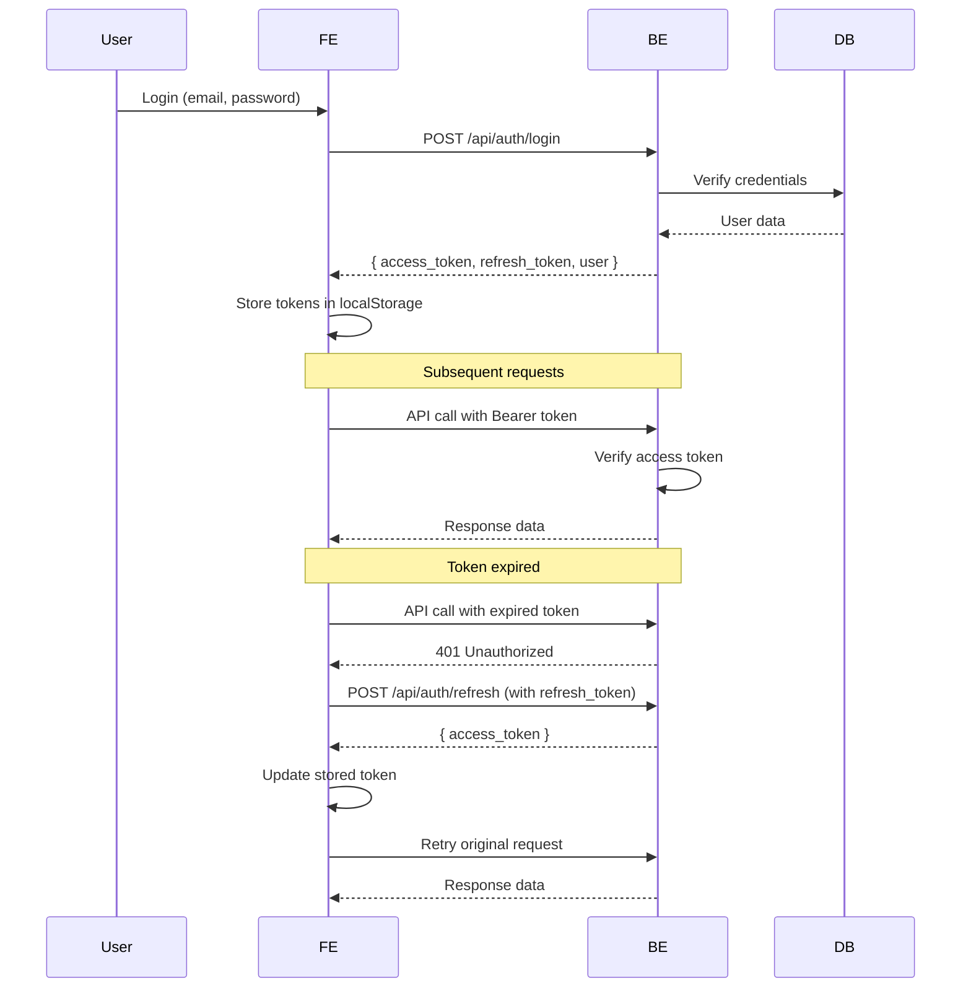

# API Module Documentation

Thư mục `api` chứa tất cả logic gọi API đến backend, được tổ chức theo từng nhóm chức năng.

> **⚠️ LƯU Ý QUAN TRỌNG**: File này chỉ chứa các API **THỰC TẾ** tồn tại trong Backend. Không tự bịa hoặc giả định endpoint mới.

## 📁 Cấu trúc

```
src/api/
├── apiClient.js      # Axios instance với interceptors
├── auth.api.js       # Authentication APIs
├── user.api.js       # User profile APIs
├── task.api.js       # Task management APIs
├── admin.api.js      # Admin user management APIs (role ADMIN required)
├── index.js          # Central export point
└── README.md         # Documentation
```

## 🎯 Nguyên tắc thiết kế

1. **Separation of Concerns**: Mỗi file chỉ quản lý một nhóm API liên quan
2. **Reusability**: Functions có thể tái sử dụng ở nhiều nơi
3. **Maintainability**: Dễ dàng thêm/sửa/xóa API endpoints
4. **Type Safety**: JSDoc comments cho mỗi function
5. **Error Handling**: Centralized error handling trong apiClient
6. **Backend-First**: Chỉ implement API đã có trong Backend, không tự thêm

## 📝 Cách sử dụng

### 1. Import từ index.js (Recommended)

```javascript
// Import theo module
import { authApi, userApi, taskApi, adminApi } from "@/api";

// Sử dụng
const { user, access_token } = await authApi.login({ email, password });
const profile = await userApi.getProfile();
const tasks = await taskApi.getAllTasks();

// Admin only
const users = await adminApi.getAllUsers();
```

```javascript
// Import individual functions
import { login, register, getProfile, createTask, getAllUsers } from "@/api";

// Sử dụng
const result = await login({ email, password });
const profile = await getProfile();
const task = await createTask({ title, description });

// Admin only
const users = await getAllUsers({ page: 1, limit: 20 });
```

### 2. Import trực tiếp từ file (Alternative)

```javascript
import { login, register } from "@/api/auth.api";
import { getProfile } from "@/api/user.api";
import { getAllUsers } from "@/api/admin.api";

const result = await login({ email, password });
```

## 📚 API Functions

### 🔐 Auth APIs (`auth.api.js`)

#### `login(credentials)`

Đăng nhập với email và password. **BE endpoint**: `POST /api/auth/login`

```javascript
const { user, access_token, refresh_token } = await login({
  email: "user@example.com",
  password: "Password123",
});

// Response format:
// {
//   access_token: string,
//   refresh_token: string,
//   user: { id, fullName, email, role, status }
// }
```

#### `register(userData)`

Đăng ký tài khoản mới. **BE endpoint**: `POST /api/auth/register`

```javascript
const { message, user } = await register({
  fullName: "Bao Le",
  email: "bao@example.com",
  password: "Password123",
});

// Response format:
// {
//   message: "User registered successfully",
//   user: { id, fullName, email, role, status }
// }
```

#### `refreshToken()`

Làm mới access token. **BE endpoint**: `POST /api/auth/refresh`

> **Lưu ý**: Refresh token được gửi qua Authorization header (Bearer)

```javascript
const { access_token, user } = await refreshToken();

// Response format:
// {
//   access_token: string,
//   user: { id, role }
// }
```

#### `logout()`

Đăng xuất (client-side only, xóa tokens trong localStorage)

```javascript
await logout();
```

---

### 👤 User APIs (`user.api.js`)

#### `getProfile()`

Lấy thông tin profile của user hiện tại. **BE endpoint**: `GET /api/users/me`

```javascript
const profile = await getProfile();

// Response format:
// {
//   id: string,
//   fullName: string,
//   email: string,
//   role: "ADMIN" | "USER",
//   status: "ACTIVE" | "INACTIVE"
// }
```

---

### ✅ Task APIs (`task.api.js`)

> **Status mapping**: FE sử dụng `pending`, `in-progress`, `completed` nhưng BE sử dụng `TODO`, `IN_PROGRESS`, `DONE`. API layer tự động convert.

#### `getAllTasks(params)`

Lấy danh sách tasks của user hiện tại. **BE endpoint**: `GET /api/tasks`

```javascript
const { data, meta } = await getAllTasks({
  status: "pending", // optional: 'pending', 'in-progress', 'completed'
  page: 1, // optional, default: 1
  limit: 10, // optional, default: 10, max: 50
});

// Response format:
// {
//   data: [{ id, title, description, status, createdAt, updatedAt }],
//   meta: { page, limit, total, totalPages, hasNextPage, hasPrevPage }
// }
```

#### `getTaskById(taskId)`

Lấy chi tiết một task. **BE endpoint**: `GET /api/tasks/:id`

```javascript
const task = await getTaskById("task-id-123");

// Response format:
// {
//   id, title, description, status, createdAt, updatedAt
// }
```

#### `createTask(taskData)`

Tạo task mới. **BE endpoint**: `POST /api/tasks`

```javascript
const task = await createTask({
  title: "Learn Express middleware", // required
  description: "Practice validateBody + requireAuth flow", // optional
  status: "pending", // optional: 'pending', 'in-progress', 'completed'
});

// Response format:
// {
//   id, title, description, status, createdAt, updatedAt
// }
```

#### `updateTask(taskId, taskData)`

Cập nhật task (partial update). **BE endpoint**: `PATCH /api/tasks/:id`

```javascript
const updated = await updateTask("task-id-123", {
  title: "Updated Title", // optional
  description: "New description", // optional
  status: "in-progress", // optional
});

// Response format:
// {
//   id, title, description, status, createdAt, updatedAt
// }
```

#### `deleteTask(taskId)`

Xóa task (soft delete). **BE endpoint**: `DELETE /api/tasks/:id`

```javascript
const result = await deleteTask("task-id-123");

// Response format:
// {
//   message: "Task deleted successfully"
// }
```

---

### 🛡️ Admin APIs (`admin.api.js`)

> **⚠️ Yêu cầu role ADMIN**: Tất cả API admin chỉ dành cho user có `role: "ADMIN"`

#### `getAllUsers(params)`

Lấy danh sách tất cả users. **BE endpoint**: `GET /api/admin/users`

```javascript
const { data, pagination } = await getAllUsers({
  page: 1, // optional, default: 1
  limit: 20, // optional, default: 20, max: 100
  role: "USER", // optional: 'ADMIN', 'USER'
  status: "ACTIVE", // optional: 'ACTIVE', 'INACTIVE'
  search: "bao", // optional: search by email or fullName
});

// Response format:
// {
//   data: [{ id, fullName, email, role, status, createdAt }],
//   pagination: { page, limit, total, totalPages }
// }
```

#### `getUserById(userId)`

Lấy chi tiết một user. **BE endpoint**: `GET /api/admin/users/:id`

```javascript
const user = await getUserById("user-id-123");

// Response format:
// {
//   id, fullName, email, role, status, createdAt, updatedAt
// }
```

#### `updateUser(userId, userData)`

Cập nhật user (role, status, fullName). **BE endpoint**: `PATCH /api/admin/users/:id`

> **Lưu ý**: Admin không thể tự thay đổi role của chính mình

```javascript
const { message, user } = await updateUser("user-id-123", {
  role: "ADMIN", // optional: 'ADMIN', 'USER'
  status: "INACTIVE", // optional: 'ACTIVE', 'INACTIVE'
  fullName: "New Name", // optional
});

// Response format:
// {
//   message: "User updated successfully",
//   user: { id, fullName, email, role, status, createdAt, updatedAt }
// }
```

#### `deleteUser(userId)`

Xóa user (soft delete, set status = INACTIVE). **BE endpoint**: `DELETE /api/admin/users/:id`

> **Lưu ý**: Admin không thể tự xóa chính mình

```javascript
const { message, user } = await deleteUser("user-id-123");

// Response format:
// {
//   message: "User deleted successfully (set to INACTIVE)",
//   user: { id, fullName, email, role, status }
// }
```

---

## 🔧 apiClient Features

### Auto Bearer Token

Token tự động được thêm vào header của mỗi request nếu user đã đăng nhập.

### Auto Token Refresh

Khi nhận 401 Unauthorized, hệ thống tự động:

1. Gọi refresh token endpoint (`POST /api/auth/refresh`)
2. Lấy access token mới
3. Retry request gốc với token mới
4. Nếu refresh thất bại → logout và redirect to login

### Error Handling

- Tất cả errors được log ra console
- Formatted error messages
- Network timeout: 10 seconds

### Request Config

```javascript
{
  baseURL: import.meta.env.VITE_API_URL || 'http://localhost:5000',
  headers: {
    'Content-Type': 'application/json',
    'Authorization': 'Bearer {accessToken}' // Auto added if available
  },
  timeout: 10000
}
```

## ✅ Best Practices

### ❌ KHÔNG làm thế này trong components:

```javascript
// BAD - Gọi trực tiếp endpoint
const response = await axios.post("/auth/login", data);
const response = await api.post("/users/profile", data);
```

### ✅ HÃY làm thế này:

```javascript
// GOOD - Dùng API functions
import { login, getProfile } from "@/api";

const result = await login(data);
const profile = await getProfile();
```

### Lợi ích:

- ✅ **Centralized**: Tất cả API calls ở một nơi
- ✅ **Type Safe**: JSDoc comments giúp IDE autocomplete
- ✅ **Reusable**: Dùng lại ở nhiều components
- ✅ **Maintainable**: Sửa endpoint chỉ cần sửa 1 chỗ
- ✅ **Testable**: Dễ dàng mock trong tests
- ✅ **Backend-First**: Chỉ sử dụng API thực tế có trong Backend

## 🔄 Thêm API mới

> **⚠️ QUAN TRỌNG**: Chỉ thêm API khi Backend đã implement và test thành công

### 1. Xác nhận API tồn tại trong Backend

- Kiểm tra Swagger UI tại `http://localhost:5000/api-docs`
- Hoặc kiểm tra routes trong `BE/src/models/**/*.routes.js`

### 2. Tạo function trong file API tương ứng

Ví dụ thêm API admin mới:

```javascript
// admin.api.js
/**
 * Cập nhật trạng thái nhiều users cùng lúc
 * PATCH /api/admin/users/bulk-update
 */
export const bulkUpdateUsers = async (userIds, updates) => {
  const response = await apiClient.patch("/api/admin/users/bulk-update", {
    userIds,
    updates,
  });
  return response.data;
};
```

### 3. Export trong `index.js`

```javascript
// Thêm vào adminApi exports
export const { getAllUsers, getUserById, updateUser, deleteUser, bulkUpdateUsers } = adminApi;
```

### 4. Sử dụng

```javascript
import { bulkUpdateUsers } from "@/api";

await bulkUpdateUsers(["user1", "user2"], { status: "INACTIVE" });
```

## 🐛 Debugging

Enable request/response logging:

```javascript
// In apiClient.js
apiClient.interceptors.request.use((config) => {
  console.log("Request:", config.method.toUpperCase(), config.url, config.data);
  return config;
});

apiClient.interceptors.response.use((response) => {
  console.log("Response:", response.status, response.config.url, response.data);
  return response;
});
```

## 📊 API Status Mapping

### Task Status

| Frontend       | Backend       |
| -------------- | ------------- |
| `pending`      | `TODO`        |
| `in-progress`  | `IN_PROGRESS` |
| `completed`    | `DONE`        |

> Conversion tự động được xử lý trong `task.api.js`

### User Role

| Value   | Description              |
| ------- | ------------------------ |
| `ADMIN` | Administrator role       |
| `USER`  | Regular user role        |

### User Status

| Value      | Description              |
| ---------- | ------------------------ |
| `ACTIVE`   | Active account           |
| `INACTIVE` | Inactive/Deleted account |

## 🔐 Authentication Flow



## 📋 Checklist khi thêm API mới

- [ ] API đã được implement và test trong Backend
- [ ] Đã kiểm tra documentation trong Swagger UI
- [ ] Đã hiểu rõ request/response format
- [ ] Đã thêm JSDoc comments đầy đủ
- [ ] Đã export function trong `index.js`
- [ ] Đã cập nhật README này
- [ ] Đã test API trong Frontend components

## 📞 Danh sách API đầy đủ

### Authentication (Public)
- `POST /api/auth/register` - Đăng ký
- `POST /api/auth/login` - Đăng nhập
- `POST /api/auth/refresh` - Làm mới token

### User (Authenticated)
- `GET /api/users/me` - Lấy profile hiện tại

### Tasks (Authenticated)
- `GET /api/tasks` - Lấy danh sách tasks
- `POST /api/tasks` - Tạo task mới
- `GET /api/tasks/:id` - Lấy chi tiết task
- `PATCH /api/tasks/:id` - Cập nhật task
- `DELETE /api/tasks/:id` - Xóa task

### Admin (Admin only)
- `GET /api/admin/users` - Lấy danh sách users
- `GET /api/admin/users/:id` - Lấy chi tiết user
- `PATCH /api/admin/users/:id` - Cập nhật user
- `DELETE /api/admin/users/:id` - Xóa user (soft delete)

### Health Check (Public)
- `GET /api/health` - Kiểm tra trạng thái server

---

**Last updated**: February 9, 2026  
**Backend API version**: 1.0.0  
**Swagger Documentation**: http://localhost:5000/api-docs

